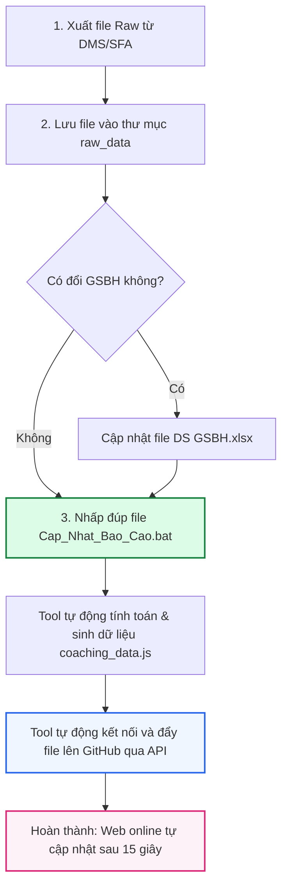

# 📘 TÀI LIỆU BÀN GIAO VẬN HÀNH & CẬP NHẬT DỮ LIỆU
## HỆ THỐNG BÁO CÁO COACHING GIÁM SÁT BÁN HÀNG (GSBH) - CJ FOODS VIỆT NAM

---

* **Người bàn giao:** Quản lý Dự án / Trưởng nhóm Sales Capability
* **Đối tượng tiếp nhận:** Nhân viên vận hành dữ liệu & báo cáo bán hàng (Sales Ops / Sales Admin)
* **Trang web báo cáo trực tuyến:** [https://cjfood.github.io/coaching-WW/](https://cjfood.github.io/coaching-WW/)
* **Kho lưu trữ mã nguồn GitHub:** [https://github.com/cjfood/coaching-WW](https://github.com/cjfood/coaching-WW)
* **Thư mục làm việc tại máy tính:** `D:\CJ\11. Adhoc\T8\WW`

---

## 📌 PHẦN 1: TỔNG QUAN HỆ THỐNG & CƠ CHẾ HOẠT ĐỘNG

Hệ thống Báo cáo Coaching GSBH là công cụ phân tích tự động, giúp theo dõi năng lực đi tuyến, huấn luyện thực địa (Field work) và chỉ tiêu KPI của toàn bộ đội ngũ Giám sát bán hàng (GSBH) 6 Vùng trên toàn quốc (Hà Nội, Hải Phòng, Đà Nẵng, Nha Trang, HCM, Cần Thơ).

### Sơ đồ quy trình tự động hóa:


---

## 📂 PHẦN 2: CẤU TRÚC THƯ MỤC CẦN NẮM VỮNG

Tất cả các tệp tin vận hành nằm tại thư mục: **`D:\CJ\11. Adhoc\T8\WW`**

| Tên tệp / Thư mục | Loại | Mô tả & Trách nhiệm của nhân viên |
| :--- | :---: | :--- |
| 📁 **`raw_data/`** | Thư mục | **NƠI CHỨA DỮ LIỆU THÔ:** Chứa các file tải về từ DMS (`.xlsb` hoặc `.xlsx`). |
| 📊 **`DS GSBH.xlsx`** | Tệp Excel | **DANH SÁCH NHÂN SỰ MASTER:** Chứa danh sách GSBH chuẩn toàn quốc. Cập nhật khi có thay đổi nhân sự. |
| ⚙️ **`Cap_Nhat_Bao_Cao.bat`** | File chạy | **CÔNG CỤ 1-CLICK:** Nhấp đúp chuột vào file này để tự động tính toán và đẩy lên web. |
| 🔑 **`github_token.txt`** | Cấu hình | **MÃ XÁC THỰC GITHUB:** Lưu mã Token bảo mật để đẩy dữ liệu tự động *(Đã cấu hình sẵn, không xóa)*. |
| 🌐 **`index.html`** | Giao diện | Giao diện Dashboard hiển thị trên web. |
| 📦 **`coaching_data.js`** | Dữ liệu | Dữ liệu web nén tự động sinh ra sau khi chạy tool. |
| 🐍 `coaching_report.py` | Code hệ thống | Script Python xử lý dữ liệu và tính toán KPI *(Không chỉnh sửa)*. |
| 🐍 `push_to_github.py` | Code hệ thống | Script Python đẩy dữ liệu tự động lên GitHub *(Không chỉnh sửa)*. |

---

## 🛠️ PHẦN 3: HƯỚNG DẪN 3 BƯỚC CẬP NHẬT DỮ LIỆU ĐỊNH KỲ

### 1️⃣ BƯỚC 1: Tải và nạp dữ liệu thô (Raw Data)
1. Đăng nhập vào hệ thống DMS/SFA của công ty.
2. Xuất báo cáo công việc thực tế của GSBH theo kỳ cần cập nhật.
3. Đổi tên file (hoặc giữ nguyên tên gốc của hệ thống), đuôi file là `.xlsx` hoặc `.xlsb`.
4. **Copy và dán file này vào thư mục: `D:\CJ\11. Adhoc\T8\WW\raw_data\`**

> [!IMPORTANT]
> **Quy tắc vàng về dữ liệu thô:**
> * **KHÔNG ĐƯỢC XÓA** các file của các tháng trước trong thư mục `raw_data/` (Ví dụ: file Tháng 7, Tháng 8). Hệ thống cần đọc tất cả các file để duy trì lịch sử và cho phép người xem chuyển đổi giữa các tháng trên Dashboard.
> * Cứ mỗi khi có dữ liệu mới, bạn chỉ cần ném thêm file mới vào thư mục này.

---

### 2️⃣ BƯỚC 2: Cập nhật Master nhân sự (Chỉ làm khi có GSBH mới / đổi vùng)
Nếu danh sách GSBH không thay đổi so với tháng trước -> **Bỏ qua bước này**.
Nếu có GSBH mới tuyển dụng, thay thế hoặc chuyển vùng:
1. Mở file **`D:\CJ\11. Adhoc\T8\WW\DS GSBH.xlsx`**.
2. Thêm dòng mới hoặc chỉnh sửa đúng các cột:
   * **Mã GSBH:** Điền mã nhân viên (Ví dụ: `CJ1414714` hoặc số `8980`).
   * **Tên GSBH:** Họ và tên đầy đủ.
   * **Tên miền:** `Miền Bắc` hoặc `Miền Nam`.
   * **Tên Vùng:** Thuộc 1 trong 6 vùng chuẩn (`Hà Nội`, `Hải Phòng`, `Đà Nẵng`, `Nha Trang`, `HCM`, `Cần Thơ`).
3. Bấm **Ctrl + S** để lưu và đóng file Excel lại.

> [!NOTE]
> File Excel của công ty có thể bị phần mềm bảo mật (DRM) mã hóa, bạn **hoàn toàn yên tâm** vì tool đã được lập trình sẵn cơ chế tự động giải mã ngầm qua Excel COM, không lo bị lỗi.

---

### 3️⃣ BƯỚC 3: Chạy cập nhật tự động bằng 1-Click
1. Tìm đến file **`Cap_Nhat_Bao_Cao.bat`** tại thư mục `D:\CJ\11. Adhoc\T8\WW`.
2. **Nhấp đúp chuột (Double-click)** vào file này.
3. Cửa sổ màu đen sẽ tự động xuất hiện và thực hiện tuần tự:
   * Tự động đóng các file Excel đang mở để giải phóng bộ nhớ.
   * Quét toàn bộ file trong thư mục `raw_data/` và file `DS GSBH.xlsx`.
   * Lọc trùng công việc Field work, chia tuần theo quy ước tháng, tính toán tỷ lệ đạt KPI.
   * Xuất file dữ liệu `coaching_data.js`.
   * **Tự động kết nối tới GitHub, đối chiếu file thay đổi và đẩy thẳng lên web.**
   * Tự động bật trình duyệt hiển thị trang web báo cáo trực tuyến.
4. Khi nhìn thấy dòng thông báo sau:
   ```text
   ============================================================
   [SUCCESS] Đã đồng bộ thành công lên GitHub!
   ⏳ Trang web online sẽ cập nhật sau khoảng 10-15 giây.
   🌐 Link xem báo cáo: https://cjfood.github.io/coaching-WW/
   ============================================================
   Press any key to continue . . .
   ```
5. Bạn nhấn một phím bất kỳ trên bàn phím để đóng cửa sổ. Quá trình cập nhật đã hoàn tất!

---

## ✅ PHẦN 4: CHECKLIST NGHIỆM THU ĐẢM BẢO DỮ LIỆU ĐÃ LÊN ĐỦ TRÊN WEB

Sau khi chạy xong, nhân viên bắt buộc thực hiện kiểm tra 4 điểm trên trang web online:

1. **Truy cập web:** Mở link [https://cjfood.github.io/coaching-WW/](https://cjfood.github.io/coaching-WW/) trên trình duyệt (Chrome / Cốc Cốc / Edge).
2. **Kiểm tra thời gian cập nhật:** Nhìn lên góc trên bên phải màn hình web, mục **`Cập nhật lần cuối`** phải hiển thị đúng ngày giờ bạn vừa chạy tool.
3. **Kiểm tra tháng dữ liệu:** Bấm vào dropdown **`Chọn Tháng`** ở góc phải trên cùng để xem tháng mới nhất đã xuất hiện và có dữ liệu hay chưa.
4. **Kiểm tra bộ lọc Tuần & Vùng:**
   * Thử chọn các tuần (Tuần 1, Tuần 2...) xem các thẻ chỉ số KPI và biểu đồ cột có chuyển đổi đúng hay không.
   * Chuyển sang tab **`Báo Cáo Chi Tiết GSBH`** xem danh sách nhân sự mới đã hiển thị chưa.
   * Chuyển sang tab **`Dữ Liệu Chi Tiết`** kiểm tra số lượng dòng dữ liệu thô.

> [!TIP]
> Nếu bạn vừa đẩy xong nhưng vào web vẫn thấy số liệu cũ, hãy nhấn tổ hợp phím **`Ctrl + F5`** (hoặc `Shift + F5`) để xóa bộ nhớ đệm (cache) của trình duyệt.

---

## 🚨 PHẦN 5: CẨM NANG XỬ LÝ SỰ CỐ THƯỜNG GẶP (TROUBLESHOOTING)

### 1. Lỗi: Màn hình đen báo lỗi Token không hợp lệ (401 Unauthorized)
* **Nguyên nhân:** Mã Token trong file `github_token.txt` bị sửa đổi hoặc bị xóa.
* **Cách xử lý:** 
  1. Mở file `github_token.txt`.
  2. Kiểm tra xem mã token có đúng dạng `ghp_...` hay không.
  3. Nếu token bị hết hạn, liên hệ quản lý hoặc tự tạo token mới trên GitHub (với quyền `repo`) và dán đè vào file này rồi lưu lại.

### 2. Lỗi: "Lỗi kết nối tới GitHub" hoặc "Connection Timeout"
* **Nguyên nhân:** Mạng Internet của máy tính bị mất kết nối hoặc mạng nội bộ công ty chặn tạm thời.
* **Cách xử lý:** Kiểm tra lại kết nối mạng Wifi/LAN, sau đó chỉ cần nhấp đúp chạy lại file `Cap_Nhat_Bao_Cao.bat`.

### 3. Lỗi: File Excel thô báo không đúng định dạng cột
* **Nguyên nhân:** File xuất từ DMS bị thiếu cột hoặc xuất nhầm mẫu báo cáo khác.
* **Cách xử lý:** Mở file raw kiểm tra xem có các cột tiêu chuẩn: `Tên Vùng`, `Tên NV Đăng Ký`, `Mã NV Đăng Ký`, `Từ Ngày`, `Đến Ngày`, `Loại Công Việc`, `Trạng Thái Công Việc` hay không.

---

## 📞 PHẦN 6: THÔNG TIN HỖ TRỢ KỸ THUẬT

* **Quản trị viên GitHub Repo:** `cjfood`
* **Repository Link:** `https://github.com/cjfood/coaching-WW`
* **Người phụ trách bàn giao:** Sales Capability Team - CJ Foods Việt Nam.
